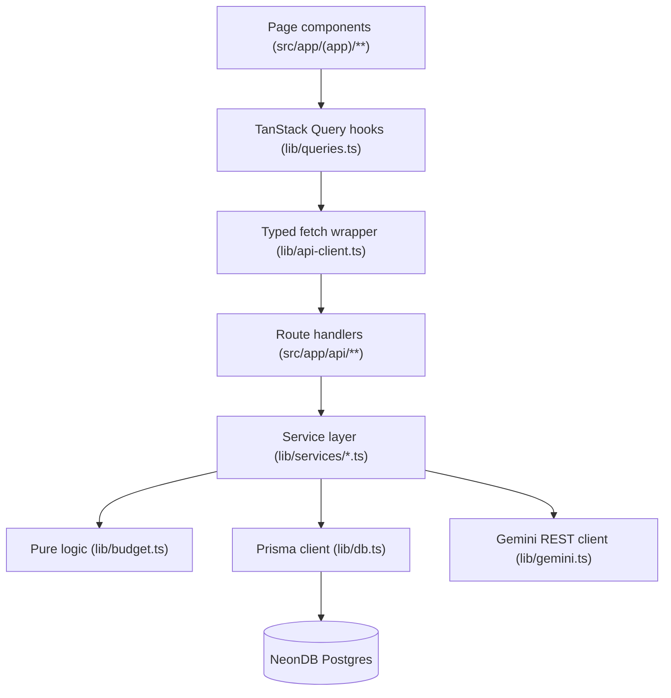

# HardCap - Architecture

## Stack

- Next.js 16, App Router, TypeScript, `src/` layout, `@/*` alias, Turbopack.
- Tailwind CSS v4 (CSS-first `@theme` in `src/app/globals.css`, no `tailwind.config`).
- NeonDB Postgres via Prisma ORM (pinned to `^6`).
- NextAuth v5 beta + `@auth/prisma-adapter`, JWT sessions. Credentials (bcrypt) + Google OAuth.
- Zod for all API input validation.
- TanStack Query + a typed fetch wrapper for client data (no direct `fetch` in components).
- GSAP / Framer Motion / react-three-fiber for motion - dashboard hero and login only.

## Layering

Requests flow strictly in one direction. Each layer only talks to the layer directly below it.



- **Route handlers** (`src/app/api/**/route.ts`) stay thin: authenticate, parse with Zod, delegate to a service function, return typed JSON. No business logic, no direct Prisma writes for anything with a service equivalent.
- **Service layer** (`src/lib/services/*.ts`) owns business logic, ownership checks, and Prisma queries. One file per domain: `groups.ts`, `expenses.ts`, `lending.ts`, `insight.ts`, `goals.ts`, `month-end-review.ts`, `analytics.ts`.
- **Pure logic** (`src/lib/budget.ts`) has no framework or DB imports - balance math only, independently unit-testable.
- **Client layer**: components never call `fetch` directly. They call a `lib/queries.ts` hook, which calls `lib/api-client.ts`, which calls the route handler.

## Auth

- `src/lib/auth.ts` configures NextAuth: Credentials provider (email + bcrypt-hashed password against `User.passwordHash`) and Google OAuth, JWT session strategy, `PrismaAdapter` for account/session persistence.
- `src/middleware.ts` gates every route except `/login`, `/signup`, `/api/auth/*`, and `/` - unauthenticated requests are redirected to `/login`.
- Every route handler independently re-checks `session?.user?.id` before touching data - middleware is a UX convenience, not the sole authorization boundary.

## Ownership enforcement (mandatory pattern)

Every mutation on a user-owned row (`ExpenseGroup`, `Expense`, `LendingEntry`) does:

```ts
const existing = await prisma.<model>.findFirst({ where: { id, userId } });
if (!existing) return null; // route maps this to 404
```

before any `update`/`delete`. A client-supplied ID is never trusted alone. See `src/lib/services/expenses.ts`, `groups.ts`, `lending.ts` for the reference implementation.

## Balance computation

Centralized in `src/lib/budget.ts` (pure, framework-free):

- `computeGroupBalance(cap, spent)` - remaining, over-cap flag, overage amount for one group.
- `computeOverallRemaining(monthlyIncome, totalSpent)` - overall balance across all groups.
- `computeUnallocatedIncome(monthlyIncome, totalCaps, totalGoalSaved?)` - income not yet assigned to any group cap or goal pot. Goal contributions are earmarked and excluded the same way group caps are.
- `computeRolloverAmount(previousCap, previousSpent)` - unspent surplus carried into next month for opted-in groups (`ExpenseGroup.rolloverEnabled`); always `>= 0`, an overspent month never reduces the next month's cap.
- `computeBudgetHealthGrade(overageFrequency)` - A-F grade from the fraction of past completed group-months that went over cap.
- `computeEmergencyFundBalance(cap, directSpent, totalOverageFromOtherGroups)` - the Emergency Fund group's own remaining balance, after absorbing every other active group's overage. `isDepleted` flags when cumulative overage exceeds the fund's cap.
- `computeBurnRate(totalSpent, totalBudget, dayOfMonth, daysInMonth)` - spend-fraction vs. time-fraction pace (`ahead` / `on-track` / `behind`), backs the dashboard's Money Burn Rate panel.
- `classifySpendIntensity(daySpend, averageDailySpend)` - buckets a day's spend (`none`/`light`/`normal`/`heavy`) relative to the trailing average, backs the GitHub-style spending heatmap.

Spend totals are always computed live from `Expense` rows grouped by month (`prisma.expense.groupBy`), never cached/denormalized - this is what guarantees zero drift between logged expenses and displayed balances (PRD primary goal). `BudgetPeriod` exists to preserve each month's historical cap when a group's current cap changes, and is also the source `computeRolloverAmount`/`computeBudgetHealth` read from for prior months' caps - it is not used for balance math on the *current* month.

"Month" is always the calendar month (UTC, `YYYY-MM` string keys, `[start of month, start of next month)` range) - there is no per-user custom billing-cycle anchor day (e.g. a salary-credit date) yet. This is a known limitation, not a bug: a user paid on the 28th currently sees balances reset on the 1st, not on their personal cycle boundary.

## Emergency Fund

Modeled as a normal `ExpenseGroup` with `isEmergencyFund: true` (at most one active per user, enforced in `src/lib/services/groups.ts#createGroup`/`updateGroup` via `EmergencyFundConflictError`, mapped to `409` by the route). `listGroupsWithBalances` computes every group's balance normally first, then sums the `overageAmount` of every *other* active group and feeds it into `computeEmergencyFundBalance` - so a group going over cap draws automatically from the Emergency Fund's balance instead of the user seeing scattered negative balances. If the fund itself is exhausted (`isDepleted`), its own `remaining` goes negative and it is flagged `isOverCap`, which the Smart Notifications center treats as a `danger`-tier alert.

## Goal savings ("pots")

`Goal` + `GoalContribution` (`src/lib/services/goals.ts`) model money set aside for a purpose - distinct from budget groups because it cannot be assigned to a group cap or spent directly. `savedAmount` only ever changes via `contributeToGoal` (signed amount: positive = deposit, negative = withdrawal), which writes a `GoalContribution` audit row and updates `Goal.savedAmount`/`isCompleted` in one transaction. `getTotalActiveGoalSaved` feeds `computeUnallocatedIncome` so goal money is excluded from "unallocated income" the same way group caps are. Goals carry forward indefinitely across months (no monthly reset) until `isCompleted`.

## Analytics (burn rate + spending heatmap)

`src/lib/services/analytics.ts` wraps the pure `computeBurnRate`/`classifySpendIntensity` functions with live Prisma aggregation: `getBurnRate` reuses `listGroupsWithBalances` for the current month's totals; `getSpendHeatmap` aggregates `Expense.amount` per day over the trailing ~182 days and classifies each day relative to the window's average daily spend. Both are folded into `GET /api/dashboard/summary` (`burnRate`, `spendHeatmap` fields) rather than separate endpoints, since they're always consumed together with the rest of the dashboard payload.

## Month-end review

No scheduler/cron exists in this app, so month-end reports are generated on-demand: the user picks a completed month (one with `BudgetPeriod` rows and no existing review) from the Insight page and triggers `POST /api/month-end-review`. `src/lib/services/month-end-review.ts#generateMonthEndReview` assembles that month's per-group cap/spent from `BudgetPeriod` + live `Expense` aggregation, calls `requestGeminiMonthEndReview` (`src/lib/gemini.ts`), and persists the result to `MonthEndReviewSnapshot` keyed on `(userId, month)` (`@@unique`) - a second request for the same month returns the cached row instead of calling Gemini again. Rejects with `MonthNotCompletedError` (mapped to `400`) if `month >= currentMonth()`.

## AI insight flow

`src/lib/services/insight.ts`:
1. Reject if the user's last `AIInsightRequestSnapshot` was created < 60s ago (`InsightCooldownError`, mapped to HTTP 429).
2. Assemble current-month income, per-group cap/spent/remaining, overall remaining, and days left in month.
3. Call `requestGeminiInsight()` (`src/lib/gemini.ts`) - server-side only, `GEMINI_API_KEY` never reaches the client. The prompt asks Gemini to respond in Markdown and include a "Reallocation suggestions" section (the feature-doc's "AI Budget Optimizer" - folded into the existing insight call rather than a separate endpoint, since it needs the same budget snapshot).
4. Persist an `AIInsightRequestSnapshot` **only on a successful Gemini response** - a failed call leaves no snapshot and does not consume the cooldown window incorrectly (the cooldown is keyed off the last successful snapshot).

Both `AIInsightRequestSnapshot.responseText` and `MonthEndReviewSnapshot.responseText` are rendered client-side with `react-markdown` + `remark-gfm` inside a `.prose-neu` CSS scope (`globals.css`) that restyles Markdown elements (headings, lists, bold, code, blockquotes) to match the display font and champagne-gold accent instead of pulling in a generic Tailwind Typography plugin.

## Smart notifications

`src/components/NotificationCenter.tsx` is mounted once in `(app)/layout.tsx` and derives alerts entirely from data the dashboard summary query already has in cache (`useDashboardSummary()`) - no separate polling/notification endpoint. It raises a toast (and, if permitted, a browser `Notification` + a short Web Audio chime) when: a group crosses 90% of its cap, a group goes over cap (including the Emergency Fund being depleted), or the overall balance goes negative. Each alert key is deduped per calendar day via `localStorage` so it fires once per condition per day, not on every page load. This is in-tab only - there is no service worker or server-push infrastructure, so alerts only fire while the dashboard data is loaded in an open tab, not as true background push notifications.

## Dynamic background

`AmbientField` (dashboard/login only, per the design constraint below) now accepts an `intensity` prop (0-1). The dashboard page passes `data.burnRate.spentFraction`, so the particle field's drift speed and opacity scale up on higher-spend days and stay subtle on light-spend days - still fully disabled under `prefers-reduced-motion`.

## Design system constraint

Dark, luxury neumorphism is a fixed PRD requirement. All surfaces use `.neu-raised` / `.neu-inset` / `.neu-pressable` utilities and CSS variables in `src/app/globals.css` - no ad-hoc shadows/borders. Every motion component must check `prefers-reduced-motion` and no-op if set (see `AmbientField.tsx`, `RevealOnMount.tsx`).

## Known architectural decisions

- Google is the OAuth provider (PRD left this open).
- `insight` and `insight/history` are separate route files, matching the PRD's exact endpoint contract - do not merge.
- Hosting target assumed Vercel; no vendor-lock-in code written either way.