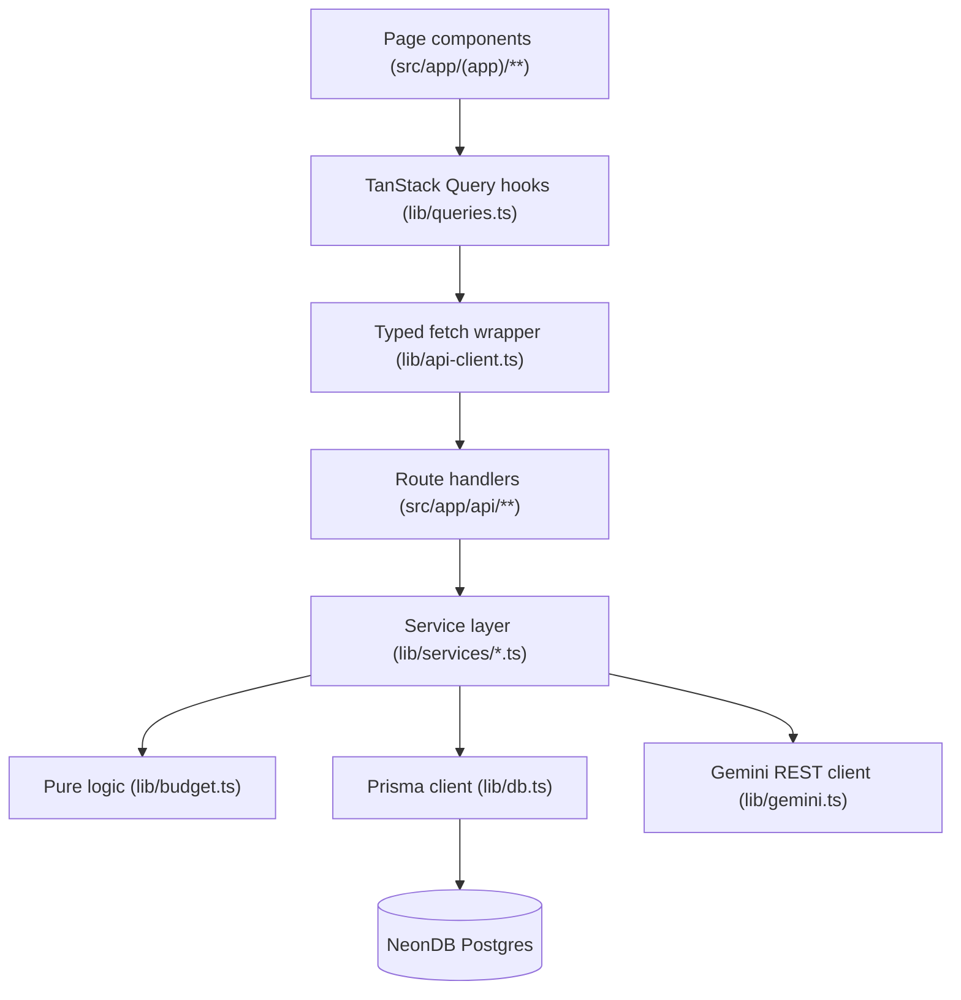

# HardCap - Architecture

## Stack

- Next.js 16, App Router, TypeScript, `src/` layout, `@/*` alias, Turbopack.
- Tailwind CSS v4 (CSS-first `@theme` in `src/app/globals.css`, no `tailwind.config`).
- NeonDB Postgres via Prisma ORM (pinned to `^6`).
- NextAuth v5 beta + `@auth/prisma-adapter`, JWT sessions. Credentials (bcrypt) + Google OAuth.
- Zod for all API input validation.
- TanStack Query + a typed fetch wrapper for client data (no direct `fetch` in components).
- GSAP / Framer Motion / react-three-fiber for motion - dashboard hero and login only.

## Layering

Requests flow strictly in one direction. Each layer only talks to the layer directly below it.



- **Route handlers** (`src/app/api/**/route.ts`) stay thin: authenticate, parse with Zod, delegate to a service function, return typed JSON. No business logic, no direct Prisma writes for anything with a service equivalent.
- **Service layer** (`src/lib/services/*.ts`) owns business logic, ownership checks, and Prisma queries. One file per domain: `groups.ts`, `expenses.ts`, `lending.ts`, `insight.ts`.
- **Pure logic** (`src/lib/budget.ts`) has no framework or DB imports - balance math only, independently unit-testable.
- **Client layer**: components never call `fetch` directly. They call a `lib/queries.ts` hook, which calls `lib/api-client.ts`, which calls the route handler.

## Auth

- `src/lib/auth.ts` configures NextAuth: Credentials provider (email + bcrypt-hashed password against `User.passwordHash`) and Google OAuth, JWT session strategy, `PrismaAdapter` for account/session persistence.
- `src/middleware.ts` gates every route except `/login`, `/signup`, `/api/auth/*`, and `/` - unauthenticated requests are redirected to `/login`.
- Every route handler independently re-checks `session?.user?.id` before touching data - middleware is a UX convenience, not the sole authorization boundary.

## Ownership enforcement (mandatory pattern)

Every mutation on a user-owned row (`ExpenseGroup`, `Expense`, `LendingEntry`) does:

```ts
const existing = await prisma.<model>.findFirst({ where: { id, userId } });
if (!existing) return null; // route maps this to 404
```

before any `update`/`delete`. A client-supplied ID is never trusted alone. See `src/lib/services/expenses.ts`, `groups.ts`, `lending.ts` for the reference implementation.

## Balance computation

Centralized in `src/lib/budget.ts` (pure, framework-free):

- `computeGroupBalance(cap, spent)` - remaining, over-cap flag, overage amount for one group.
- `computeOverallRemaining(monthlyIncome, totalSpent)` - overall balance across all groups.
- `computeUnallocatedIncome(monthlyIncome, totalCaps)` - income not yet assigned to any group cap.
- `computeRolloverAmount(previousCap, previousSpent)` - unspent surplus carried into next month for opted-in groups (`ExpenseGroup.rolloverEnabled`); always `>= 0`, an overspent month never reduces the next month's cap.
- `computeBudgetHealthGrade(overageFrequency)` - A-F grade from the fraction of past completed group-months that went over cap.

Spend totals are always computed live from `Expense` rows grouped by month (`prisma.expense.groupBy`), never cached/denormalized - this is what guarantees zero drift between logged expenses and displayed balances (PRD primary goal). `BudgetPeriod` exists to preserve each month's historical cap when a group's current cap changes, and is also the source `computeRolloverAmount`/`computeBudgetHealth` read from for prior months' caps - it is not used for balance math on the *current* month.

"Month" is always the calendar month (UTC, `YYYY-MM` string keys, `[start of month, start of next month)` range) - there is no per-user custom billing-cycle anchor day (e.g. a salary-credit date) yet. This is a known limitation, not a bug: a user paid on the 28th currently sees balances reset on the 1st, not on their personal cycle boundary.

## AI insight flow

`src/lib/services/insight.ts`:
1. Reject if the user's last `AIInsightRequestSnapshot` was created < 60s ago (`InsightCooldownError`, mapped to HTTP 429).
2. Assemble current-month income, per-group cap/spent/remaining, overall remaining, and days left in month.
3. Call `requestGeminiInsight()` (`src/lib/gemini.ts`) - server-side only, `GEMINI_API_KEY` never reaches the client.
4. Persist an `AIInsightRequestSnapshot` **only on a successful Gemini response** - a failed call leaves no snapshot and does not consume the cooldown window incorrectly (the cooldown is keyed off the last successful snapshot).

## Design system constraint

Dark, luxury neumorphism is a fixed PRD requirement. All surfaces use `.neu-raised` / `.neu-inset` / `.neu-pressable` utilities and CSS variables in `src/app/globals.css` - no ad-hoc shadows/borders. Every motion component must check `prefers-reduced-motion` and no-op if set (see `AmbientField.tsx`, `RevealOnMount.tsx`).

## Known architectural decisions

- Google is the OAuth provider (PRD left this open).
- `insight` and `insight/history` are separate route files, matching the PRD's exact endpoint contract - do not merge.
- Hosting target assumed Vercel; no vendor-lock-in code written either way.