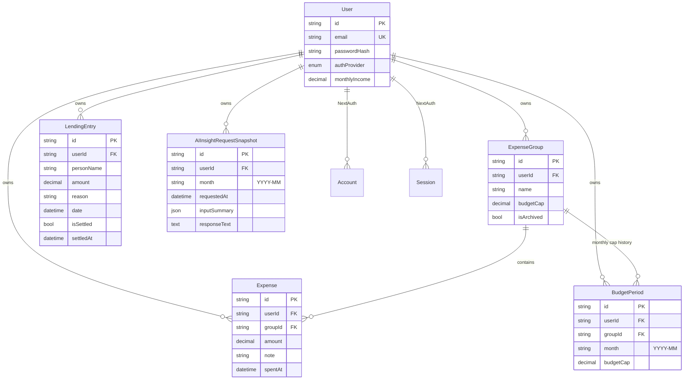

# HardCap — Database

NeonDB Postgres, schema owned by Prisma (`prisma/schema.prisma`). Prisma pinned to `^6` — see [ARCHITECTURE.md](ARCHITECTURE.md) / [copilot-instructions.md](../.github/copilot-instructions.md) for why (do not upgrade to the `8.x`/`next` channel).

## ER overview

`Account`, `Session`, `VerificationToken` are standard NextAuth/`@auth/prisma-adapter` tables (OAuth account linking, JWT-adjacent session rows, email-verification tokens) — not modified from the adapter's expected shape.

## Tables

### `users`
Per-user record. `passwordHash` is nullable (OAuth-only users have none). `authProvider` enum: `credentials` | `google`. `monthlyIncome` is `Decimal(12,2)`, defaults to `0`.

### `expense_groups`
User-defined budget categories with a hard cap (`budgetCap`, `Decimal(12,2)`). `isArchived` soft-deletes a group (archive, not delete — historical expenses/periods stay intact). Unique on `(userId, name)` — case-sensitive at the DB level; the `groups` POST route does an additional case-insensitive duplicate check before insert. Indexed on `userId`.

### `budget_periods`
Snapshots a group's `budgetCap` per calendar month (`month`, `"YYYY-MM"` string). Written on group creation and whenever `budgetCap` changes (upsert keyed on `(groupId, month)`). Exists so editing a group's *current* cap never rewrites the budget figure for past months. **Not read for current-month balance math** — current spend/remaining is always computed live from `expense_groups.budgetCap` and live-aggregated `expenses`. Unique on `(groupId, month)`, indexed on `(userId, month)`.

### `expenses`
One row per logged transaction. `amount` positive `Decimal(12,2)`, `note` optional (max 280 chars, enforced by Zod), `spentAt` defaults to submit time if not provided. Indexed on `(userId, groupId, spentAt)` (group-filtered date-range queries) and `(userId, spentAt)` (unfiltered date-range queries, e.g. dashboard charts).

### `lending_entries`
Independent ledger — does **not** affect budget/expense totals. `personName`, `amount`, `reason` (optional), `date`, `isSettled` (bool) + `settledAt` (set when marked settled, cleared to `null` when unmarked). Indexed on `userId`.

### `ai_insight_snapshots`
One row per **successful** Gemini call. `inputSummary` (`Json`) stores the exact payload sent to Gemini (month, income, per-group cap/spent/remaining, days remaining); `responseText` (`Text`) stores the raw advice text. Indexed on `(userId, month)`. A failed Gemini call writes nothing.

## Conventions

- All PKs are `String @id @default(uuid())`.
- All money fields are `Decimal @db.Decimal(12, 2)` — never `Float`, to avoid binary floating-point rounding on currency. Converted to JS `number` only at the API-response boundary (`Number(decimal)`).
- All user-owned tables have a direct `userId` FK with `onDelete: Cascade` — deleting a `User` cascades all their data.
- `@@map(...)` gives every table a lowercase/snake_case physical name distinct from the PascalCase Prisma model name.

## Migrations

Schema-first workflow: edit `prisma/schema.prisma`, then `npx prisma migrate dev --name <change>` to generate + apply a migration, followed by `npx prisma generate` to regenerate the client. Requires a live `DATABASE_URL` (NeonDB connection string) in `.env.local` — not something an agent can provision.